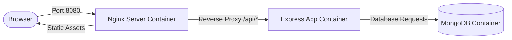

# Raise2Solve Architecture Documentation

This document describes the containerized architecture of the Raise2Solve application.

## Local Docker Architecture

### Components

1. **Frontend (Port 8080):** 
   - Served using a multi-stage Docker build.
   - Built React files are hosted inside an Nginx instance.
   - All `/api/` traffic is reverse-proxied to the backend dynamically.

2. **Backend (Port 5000):**
   - Express server exposed on port 5000.
   - Exposes `/health` for health checks.
   - Connects to MongoDB container.

3. **Database (Port 27017):**
   - Official MongoDB 6.0 container.
   - Uses a persistent Docker volume (`mongo-data`).
